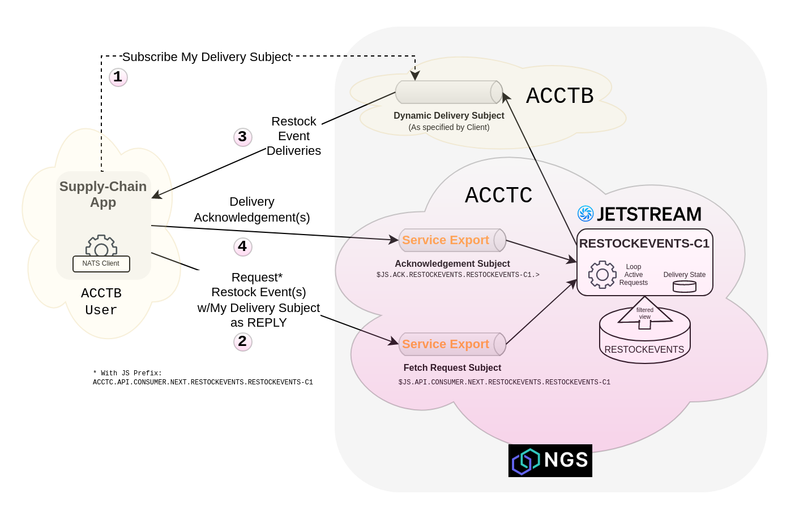

# Share JetStream as a Service 

Using the `add export`, `generate activation` and `add import` commands of the `nsc` tool, a durable JetStream
Consumer may be made available to other accounts as a _service_.

> Note: A service provider may choose to make their service available to _any_ account in NGS (_public_ export) or to
> selected accounts only (_private_ export). Private export is shown in this guide.

A service-style JetStream Consumer, also known as a Pull JS Consumer, does message delivery to a _dynamic subject_ 
specified by each consuming application when the application makes a message consumption request. 

> Note: Zero, one or many message deliveries may be streamed to a consuming application as a result of a single
> consumption request. The rate and frequency of message delivery with a Pull JS Consumer is inherently controlled
> by each of the consuming client applications based on its own client capacity.

## Restock Events Scenario

For illustration, we consider a stream of business event notifications from a system (within ACCTC) handling retail
inventory signals and restocking. These event messages trigger actions in multiple downstream systems. Restock events are
ingested into a JetStream named `RESTOCKEVENTS`.

A supply-chain application in ACCTB needs to reliably see and process the restock events.

ACCTC has set up a JetStream Consumer named `RESTOCKEVENTS-C1` for ACCTB's application to receive restock events. The steps
below show how to grant ACCTB access to use the service in its event processing application.

> See also [ngs-xacct-demo/js-consumer-service](https://github.com/ConnectEverything/ngs-xacct-demo/tree/main/js-consumer-service) for
> scenario scripts and JetStream configuration.



## As the service provider account (ACCTC)

###### Publish Restock Events

You may use the NATS command-line tool to provide a mock Restock service that publishes Restock Requested event notifications.
```bash
nats request --context "<ACCTC USER CONTEXT>" "retail.v1.restock.requested" "Restock for item 5678 pronto!"
15:24:42 Sending request on "retail.v1.restock.requested"
15:24:42 Received on "_INBOX.AFIRFuyu54agRhhiaXNEMG.OK9qWFoT" rtt 21.060591ms
{"stream":"RESTOCKEVENTS", "domain":"ngstest", "seq":9}
```
> Note: This is an optional step. Cross-account grants may be made at any time and do not depend on an extant JetStream.

> Note: ACCTB will not receive any messages until the following steps are complete.

###### Make ACCTC Restock Events eligible for consumption by other accounts

Add private exports of the following Restock Events services in ACCTC with the `nsc add export` command:

| Export                            | Grant   | Subject                                                    | Export Required |
|-----------------------------------|---------|------------------------------------------------------------|-----------------|
| Request message delivery          | service | `$JS.API.CONSUMER.MSG.NEXT.RESTOCKEVENTS.RESTOCKEVENTS-C1` | Yes             |
| Acknowledge a delivered message   | service | `$JS.ACK.RESTOCKEVENTS.RESTOCKEVENTS-C1.>`                 | Yes             |
| Request JetStream consumer status | service | `$JS.API.CONSUMER.INFO.RESTOCKEVENTS.RESTOCKEVENTS-C1`     | Optional        |

```bash
nsc add export --private --account "<ACCTC NAME>" --name "RESTOCKEVENTS-GRANT-NEXT" --subject "\$JS.API.CONSUMER.MSG.NEXT.RESTOCKEVENTS.RESTOCKEVENTS-C1" --service --response-type "Stream"
nsc add export --private --account "<ACCTC NAME>" --name "RESTOCKEVENTS-GRANT-ACK" --subject "\$JS.ACK.RESTOCKEVENTS.RESTOCKEVENTS-C1.>" --service
nsc add export --private --account "<ACCTC NAME>" --name "RESTOCKEVENTS-GRANT-INFO" --subject "\$JS.API.CONSUMER.INFO.RESTOCKEVENTS.RESTOCKEVENTS-C1" --service
```
> Note: Request message delivery service export should include `--response-type "Stream"` to allow multiple messages to be delivered to the client's reply subject in response.

> Note: an export only makes a subject _eligible_ to be imported into another account's namespace. Other accounts must
> explicitly import the subject. If the export is private (as here), other accounts must be in possession of an
> import grant activation token generated and provided by the exporter.

###### Specifically allow ACCTB access to the Restock Events service 

Generate grant activation tokens for ACCTB with the `nsc generate activation` command:
```bash
nsc generate activation --output-file "RESTOCKEVENTS-GRANT-NEXT-ACCTB.tok" --account "<ACCTC NAME>" --subject "\$JS.API.CONSUMER.MSG.NEXT.RESTOCKEVENTS.RESTOCKEVENTS-C1" --target-account "<ACCTB PUBLICKEY>"
nsc generate activation --output-file "RESTOCKEVENTS-GRANT-ACK-ACCTB.tok" --account "<ACCTC NAME>" --subject "\$JS.ACK.RESTOCKEVENTS.RESTOCKEVENTS-C1.>" --target-account "<ACCTB PUBLICKEY>" 
nsc generate activation --output-file "RESTOCKEVENTS-GRANT-INFO-ACCTB.tok" --account "<ACCTC NAME>" --subject "\$JS.API.CONSUMER.INFO.RESTOCKEVENTS.RESTOCKEVENTS-C1"  --target-account "<ACCTB PUBLICKEY>"
```

> Note: ACCTC must know ACCTB's NGS public key.

Provide the generated token files to the ACCTB owner.

## As the API using account (ACCTB)

###### Accept access to Restock Events 

Import grants using the ACCTC-provided activation token with the `nsc add import` command:

| Import                            | Grant   | Import Required | JS Prefix Required |
|-----------------------------------|---------|-----------------|--------------------|
| Request message delivery          | service | Yes             | Yes                |
| Acknowledge a delivered message   | service | Yes             | No                 |
| Request JetStream consumer status | service | Optional        | Yes                |

```bash
nsc add import --token "RESTOCKEVENTS-GRANT-NEXT-ACCTB.tok" --account "<ACCTB NAME>" --name "RESTOCKEVENTS-GRANT-NEXT" --local-subject "ACCTC.API.CONSUMER.MSG.NEXT.RESTOCKEVENTS.RESTOCKEVENTS-C1"
nsc add import --token "RESTOCKEVENTS-GRANT-ACK-ACCTB.tok" --account "<ACCTB NAME>" --name "RESTOCKEVENTS-GRANT-ACK" --local-subject "\$JS.ACK.RESTOCKEVENTS.RESTOCKEVENTS-C1.>"
nsc add import --token "RESTOCKEVENTS-GRANT-INFO-ACCTB.tok" --account "<ACCTB NAME>" --name "RESTOCKEVENTS-GRANT-INFO" --local-subject "ACCTC.API.CONSUMER.INFO.RESTOCKEVENTS.RESTOCKEVENTS-C1"
```

###### Subscribe to Restock Events

You may use the NATS command-line tool to create a mock service that processes Restock Events.
```bash
nats consumer next --context "<ACCTB USER CONTEXT>" --js-api-prefix "ACCTC.API" --ack --count 1 "RESTOCKEVENTS" "RESTOCKEVENTS-C1"
[15:26:43] subj: retail.v1.restock.requested / tries: 1 / cons seq: 9 / str seq: 9 / pending: 0

Restock for item 5678 pronto!

Acknowledged message
```
<hr>
&copy; 2022 Synadia Communications. All rights reserved.

